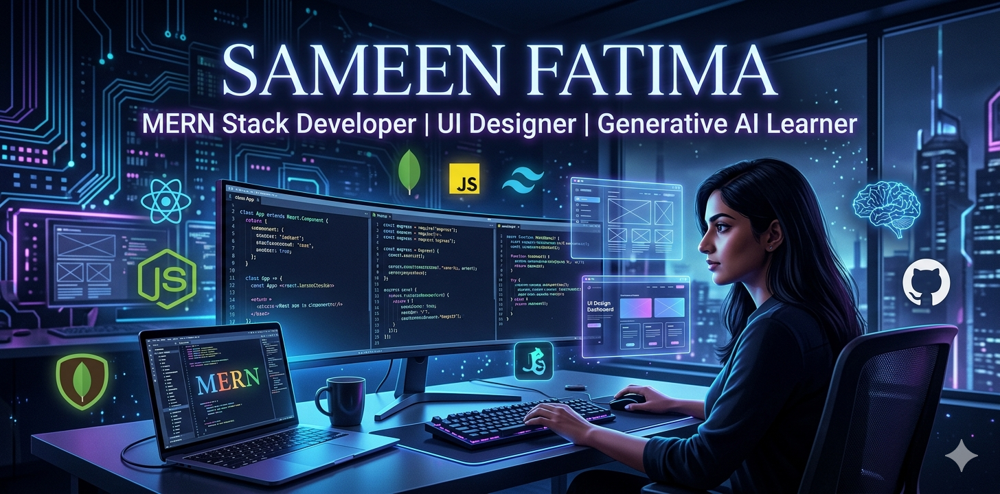

  

<h1 align="center">Hi 👋, I'm Sameen Fatima</h1>

<h3 align="center">
Frontend Developer | MERN Stack Developer | UI/UX Designer | WordPress Developer
</h3>

🚀 Passionate about building modern, responsive & user-friendly web experiences

---

### 👩‍💻 About Me

- 🌱 Currently learning **MERN Stack & Generative AI**
- 🎨 Skilled in **UI/UX Design & Frontend Development**
- 💻 Working with **React.js, Tailwind CSS, Node.js & MongoDB**
- 🛒 Experienced in **WordPress & WooCommerce**
- 🎯 Passionate about clean UI and responsive design
- 📍 Based in Karachi, Pakistan
- ⚡ **Fast learner** with a **resilient attitude**—always ready to tackle new challenges!

---

## 🚀 Tech Stack

### ⚡ Primary: MERN Stack & Frontend

  

### 🎨 Secondary: UI/UX Design & WordPress

  

### 🛠 Tools

  

---

# 📌 Featured Projects

## 🛒 E-Commerce Admin Dashboard
💡 React.js + Tailwind CSS + Node.js based admin dashboard with inventory and revenue management.

---

## 🌦 Weather App
🌍 Weather application using OpenWeatherMap API for Pakistani cities.
🔗 [Live Demo](https://dancing-cobbler-9fba91.netlify.app/)

---

## 🍽 Salt & Paper Restaurant Website
✨ SEO-friendly responsive restaurant landing page.
🔗 [Live Demo](https://courageous-hummingbird-7d36f1.netlify.app/)

---

## 🚗 Tere Ride-Sharing Page
🚀 Responsive community management platform.
🔗 [Live Demo](https://whimsical-lamington-facdcf.netlify.app/)

---

## 💼 Nexcent SaaS Landing Page
🎨 Fully responsive Figma-to-code layout using Flexbox & Grid.
🔗 [Live Demo](https://dulcet-cocada-0a4035.netlify.app/)

---

## 💖 DOWN Dating Promo Site
🔥 Modern Bootstrap UI landing page.
🔗 [Live Demo](https://effervescent-sopapillas-124e9a.netlify.app/)

---

## 🏆 Athlete's Edge Sports Website
⚡ Dynamic and responsive sports website.
🔗 [Live Demo](https://effervescent-tapioca-fab50c.netlify.app/)

---

## 🏆 Achievements & Certifications

### 🥇 Awards
- **2nd Position - SMIT Hackathon 2026**: Awarded for outstanding performance and innovation in web development.

### 📜 Certifications
- **Cisco Certified: HTML, CSS, and JavaScript**: Verified proficiency in core web technologies.

---

# 📊 GitHub Stats

---

# 🔥 GitHub Streak

---

# 🐍 Contribution Snake Animation

---

# 🌐 Connect With Me

---

# 📫 Contact Me

📧 sameen.fatima993@gmail.com

🌍 Portfolio  
https://luminous-faun-e1e571.netlify.app/

---

<h3 align="center">
✨ “Design. Develop. Innovate.” ✨
</h3>
